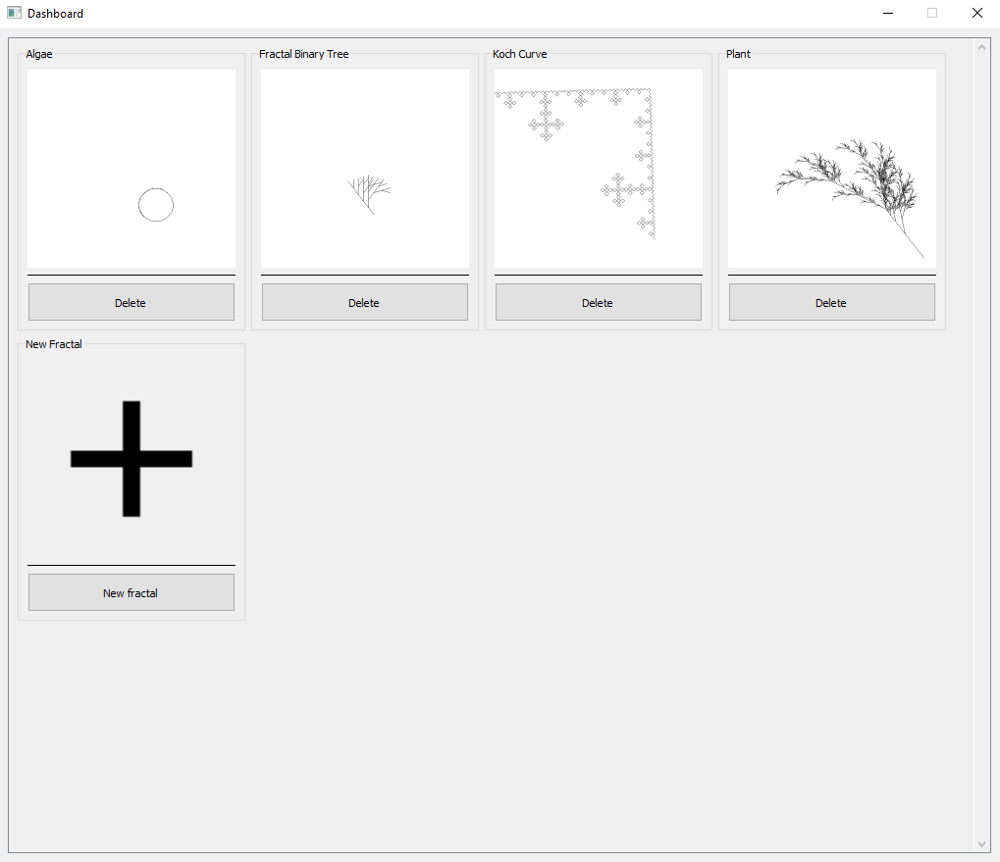
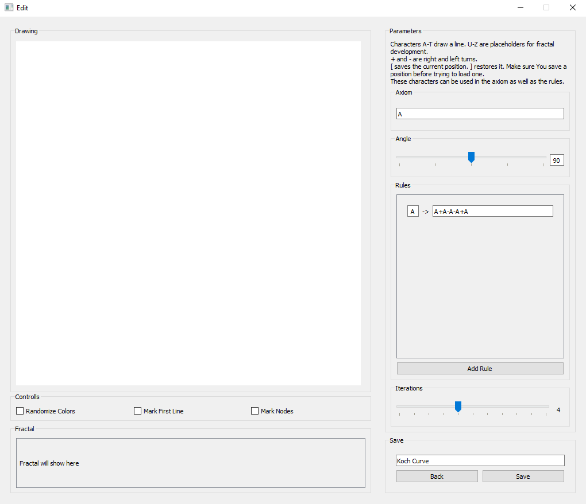

# L-Systems

## What is this?
This is a semester project created for the UUR-E course during the summer semester at the UWB.  

## What are hey and how do they work?
In short, they describe a formal grammer for creating a string of instructions to grow an axiom. The axiom is the starting point. It is the initial string. It gets expanded by applying rules. The rules convert a character to a fixed list of other character. With each iteration, the rules are applied for each character in the string.  
To learn more about L-systems you can chack out the [wikipedia](https://en.wikipedia.org/wiki/L-system) article.

## The project
This project acts as a visualization for L-systems. You can create new L-systems, draw them as well as save and manage them in a home made GUI.

### Requirements
The project is created using Python3. Furthermore You will need to install the [PySide2](https://pypi.org/project/PySide2/) package.

### Running the project
To run the GUI, execute the `fractal_ui.py`. This can be found in the main directory of the project.  

### The Dashboard
When You run the project, the first screen you will see is the dashboard. It looks like this:  
  
Here you can see all the systems you already saved. It comes with a few default ones to give you an idea about how it works. You can click on any of them to open them. Or you can click on the new button to create a new one. As an example, let's open up the "Koch Curve". You will then be greeted by the:

### Edit Screen
The edit screen for the "Koch Curve" looks as follows:  
  
Let's have a closer look at its parts. The left side is where all the drawing of the fractal happens. To draw it, simply click and drag inside the "Drawing" section to draw the first segment of your L-system. this will be used as a reference to draw your L-system. Give is a try.  
Next let's have a look at the controls we can find below. There are three options. The first option, "Randomize Colors" gives each segment in the fractal a random color. The second option markes the first segment, the one You drew manually, in red. The last option, "Mark Nodes", draws a small circle at the end of each of the segments.  
Below it we can find the Fractal. This shows Your string after all the iterations with all the rules applied.  
On the right side, You will find all things necessary to define your L-system. At the top You can find some information about the possible characters you can use for this. First you can define the Axiom. The start string. Next is the angle in degree for when Your L-system contains a `+` or `-`. Next You find the section where You define all the rules. The left side of the rule is the character to be replaced, the right side the characters which it will be replaced with. You can add new rules and remove existing. Below we find the iterations. This defines how many times the string should have the rules applied. Quick warning: having complex rules with many iterations might take some time to draw. Whist this is being processed the program freezes up. This is due to everything being processed in one thread.  
The last section is where we can save our L-system. To save it, simply provide a name and hit save. After saving, You can return to the dashboard from here. There you will find Your new system.  
